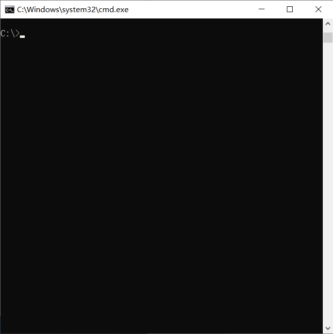

<!--
 * @Descripttion: README.MD
 * @Author: Qingao Chai
 * @Date: 2020-02-29 11:16:51
 * @LastEditors: Qingao Chai
 * @LastEditTime: 2020-03-03 19:54:49
 -->

# 生产者消费者问题的OpenMP实现

## 简介

[生产者消费者问题](https://zh.wikipedia.org/wiki/%E7%94%9F%E4%BA%A7%E8%80%85%E6%B6%88%E8%B4%B9%E8%80%85%E9%97%AE%E9%A2%98)（Producer-consumer problem），也称有限缓冲问题（Bounded-buffer problem），是一个多线程同步问题的经典案例。该问题描述了共享固定大小缓冲区的两个线程——即所谓的“生产者”和“消费者”——在实际运行时会发生的问题。生产者的主要作用是生成一定量的数据放到缓冲区中，然后重复此过程。与此同时，消费者也在缓冲区消耗这些数据。该问题的关键就是要保证生产者不会在缓冲区满时加入数据，消费者也不会在缓冲区中空时消耗数据。

本项目针对该问题，使用OpenMP编程，实现生产者向缓冲区发送消息，消费者从缓冲区读取消息并打印。

## 依赖

- g++
- OpenMP

## 用法

```sh
mkdir build
cd build
cmake ..
make
```

## 演示

```sh
OpenMP_PCP
```

在本实例中，设置队列长度为10，生产者为线程0与线程1，消费者为线程2与线程3。生产者发送A-Z共26个字母，消费者负责接收。为了便于观察，这里设置生产者发送消息需要0-500ms（随机），消费者接受消息需要500-1000ms（随机）。


